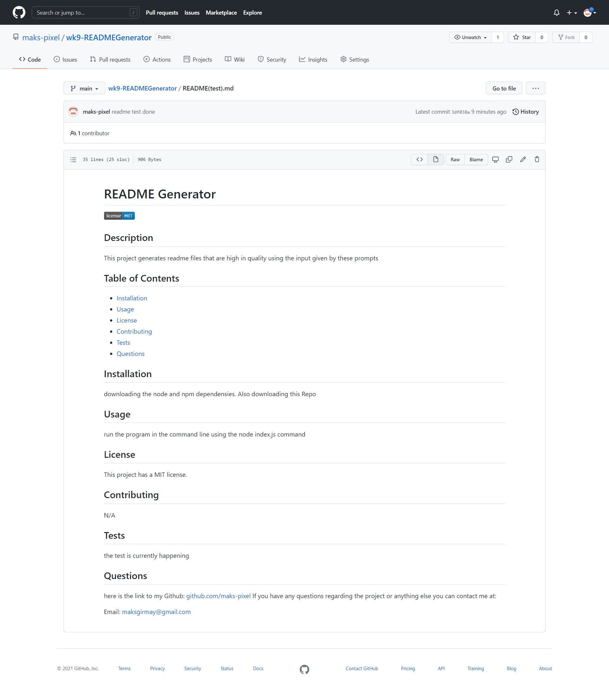

# README Generator
  
 
 ## Description
 
 This project generates a new high quality README.md file using the users input through the command line prompts.
 [Click here](https://watch.screencastify.com/v/0dtVDLDxZPeAPc5EbrfA) to the video that shows what it looks like when using the program.
 This is the screenshot of the result of the video's README file that was created:
 [screenshot.png](assets/images/screenshot.png)

 ## Table of Contents
 * [Installation](#Installation)
 * [Usage](#Usage)
 * [Contributing](#Contributing)
 * [Tests](#Tests)
 * [Questions](#Questions)
 
 ## Installation
 You have to download the repo and install node if you dont aleady have node on your computer. Then you have to insall npm. This adds the npm dependencies to run the program.

 ## Usage
 To run the project open the project in your command line. Then run your the index file using node. 
 
 ## Contributing
 N/A

 ## Tests
 Running through the code and creating the test README file to see if all the prompts work 

 ## Questions
 here is the link to my Github: [github.com/maks-pixel](github.com/maks-pixel)
 If you have any questions regarding the project or anything else you can contact me at:
 
  Email: [maksgirmay@gmail.com](maksgirmay@gmail.com) 
